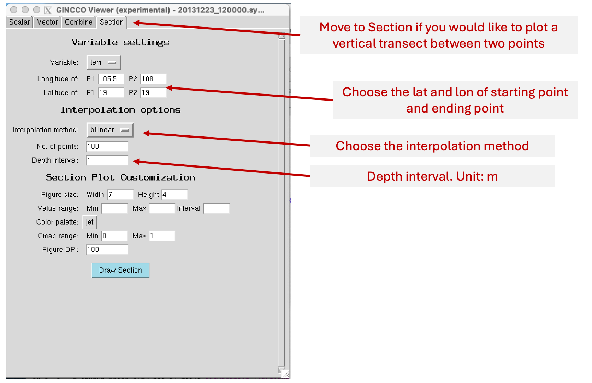
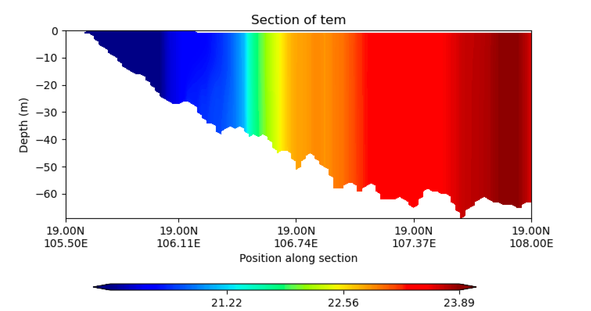

Quick view a transect
=====================

This example demonstrates how to quickly make a plot with GINCCO view

Now we will open GINCCO view

.. code-block:: bash

   # In case grid.nc is in the same folder
   gincco view 20131223_120000.symphonie.nc

   # In case a grid file in different folder, for example
   gincco view 20131223_120000.symphonie.nc --grid ../OFFLINE/grid.nc 

To plot a transect between two points, please use the function provided in the “Section” tab.

And the results

