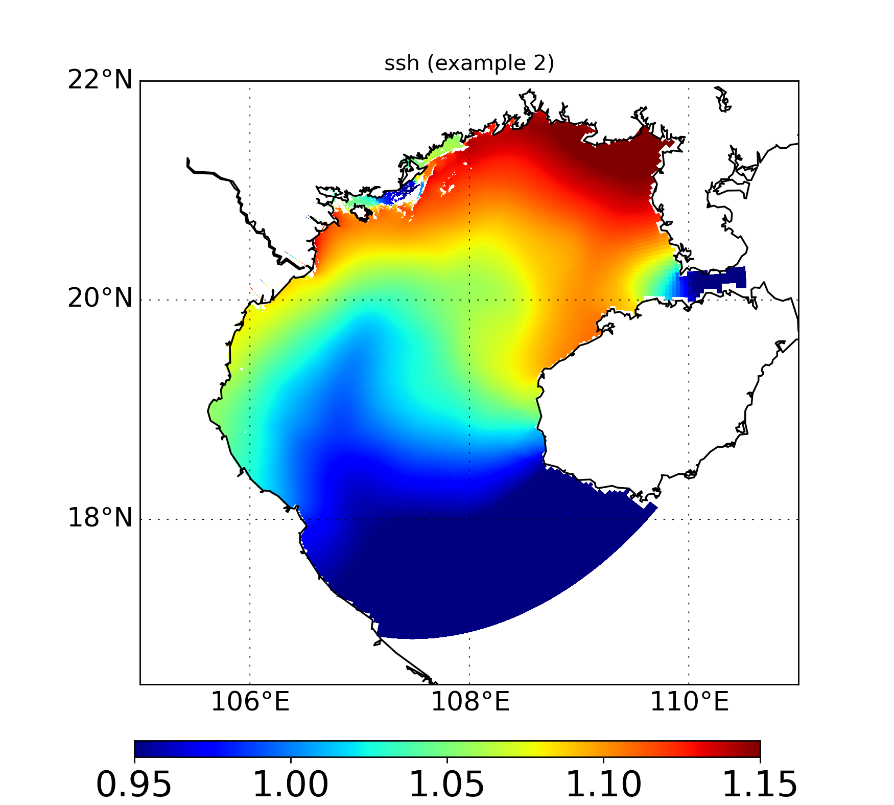
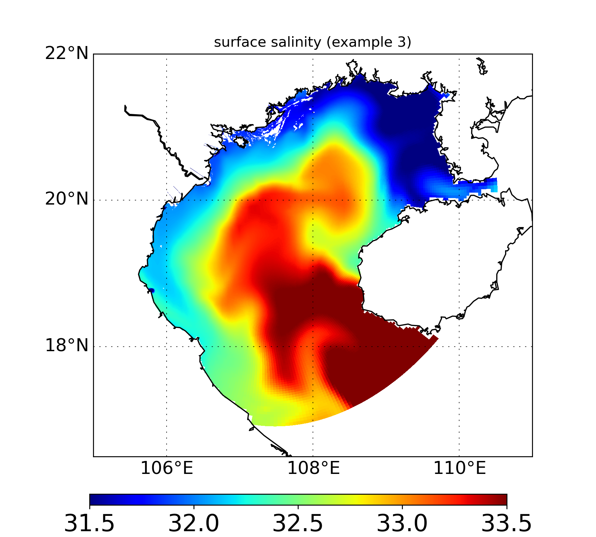
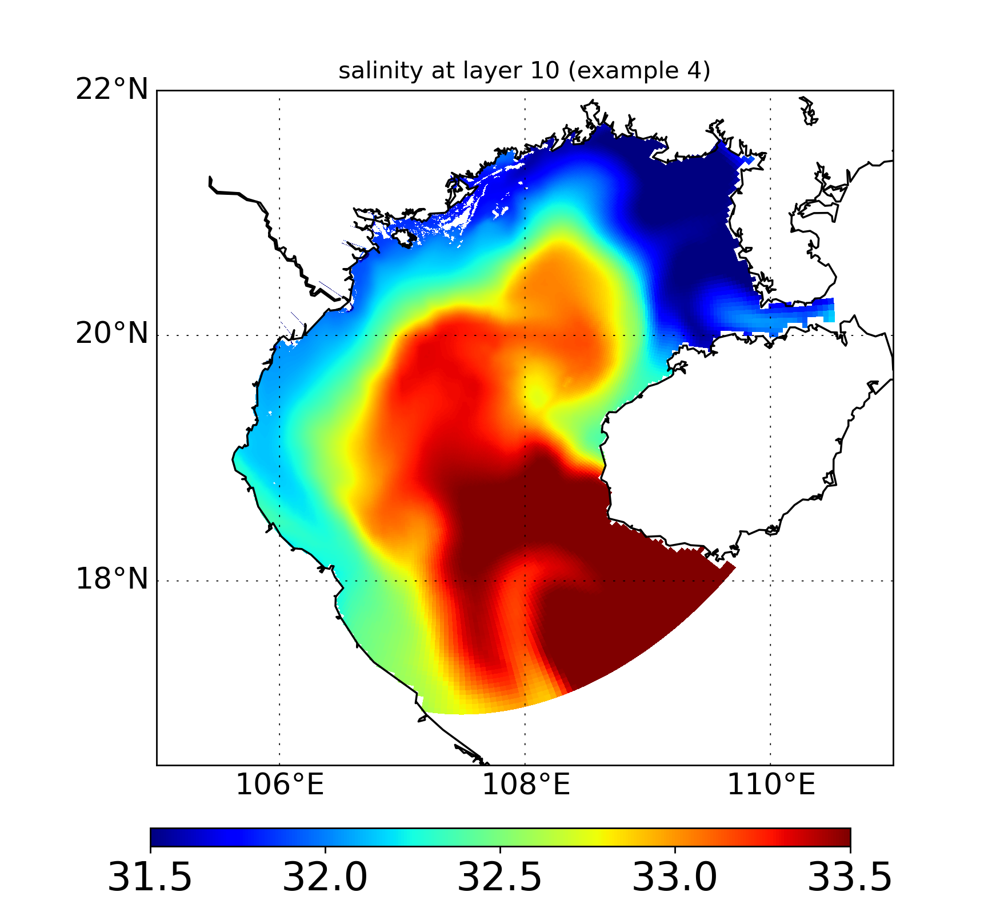
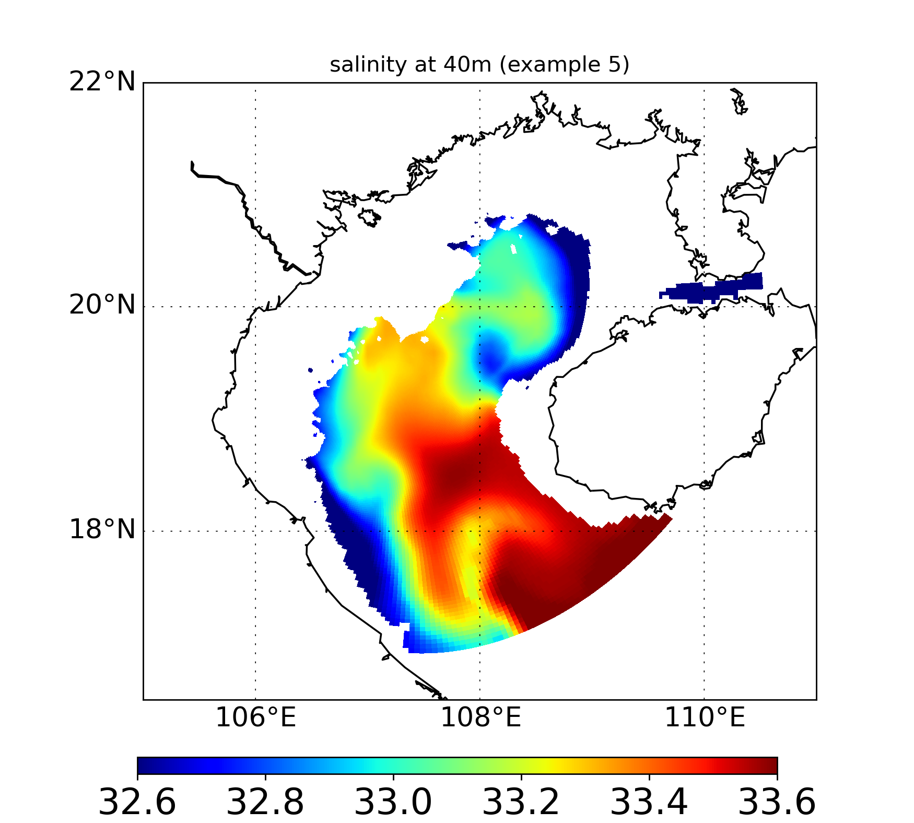

Example 1: Load a list and create a map
=======================================

This example demonstrates how to import file and draw a single map with GINCCO_lib
using :func:`GINCCO_lib.map_plot.map_draw`.

Code Example
------------

Now we will import the library and the grid

.. code-block:: python

   # =========================
   # IMPORTS
   # =========================
   import numpy as np
   import GINCCO_lib as gc
   from netCDF4 import Dataset
   from datetime import *

   # =========================
   # CONFIGURATION
   # =========================
   tstart = datetime(2010, 1, 1)
   tend   = datetime(2010, 1, 10)

   path = '/work/users/tungnd/GOT271/GOT_REF5/OFFLINE/'

   # =========================
   # LOAD GRID
   # =========================
   fgrid = Dataset(path + 'grid.nc', 'r')
   lat_t = fgrid.variables['latitude_t'][:]
   lon_t = fgrid.variables['longitude_t'][:]

Now the first example 

.. code-block:: python

   # ============================================================
   # EXAMPLE 1: import_4D (time, depth, lat, lon) -> plot level 0, day 0
   # ============================================================
   sal_full = gc.import_4D(path, 'sal', tstart, tend, ignore_missing='False')

   gc.map_draw(
       lon_min=105, lon_max=111,
       lat_min=16.5, lat_max=22,
       title="Bottom salinity (example 1)",
       lon_data=lon_t,
       lat_data=lat_t,
       data_draw=sal_full[0, 0, :, :],  # day 0, level 0
       path_save="/prod/projects/data/tungnd/figure/",
       name_save="demo_01"
   )

Second example

.. code-block:: python

   # ============================================================
   # EXAMPLE 2: import_3D (ssh_ib) -> plot day 0
   # ============================================================
   ssh = gc.import_3D(path, 'ssh_ib', tstart, tend, ignore_missing='False')

   gc.map_draw(
       lon_min=105, lon_max=111,
       lat_min=16.5, lat_max=22,
       title="ssh (example 2)",
       lon_data=lon_t,
       lat_data=lat_t,
       data_draw=ssh[0, :, :],
       path_save="/prod/projects/data/tungnd/figure/",
       name_save="demo_02"
   )

Third example

.. code-block:: python   

   # ============================================================
   # EXAMPLE 3: import_surface (sal) -> surface salinity, day 0
   # ============================================================
   sal_surface = gc.import_surface(path, 'sal', tstart, tend, ignore_missing='False')

   gc.map_draw(
       lon_min=105, lon_max=111,
       lat_min=16.5, lat_max=22,
       title="surface salinity (example 3)",
       lon_data=lon_t,
       lat_data=lat_t,
       data_draw=sal_surface[0, :, :],
       path_save="/prod/projects/data/tungnd/figure/",
       name_save="demo_03"
   )

Fourth example

.. code-block:: python   

   # ============================================================
   # EXAMPLE 4: import_layer (sal, layer=10) -> plot day 0
   # ============================================================
   sal_layer = gc.import_layer(path, 'sal', tstart, tend, 10, ignore_missing='False')

   gc.map_draw(
       lon_min=105, lon_max=111,
       lat_min=16.5, lat_max=22,
       title="salinity at layer 10 (example 4)",
       lon_data=lon_t,
       lat_data=lat_t,
       data_draw=sal_layer[0, :, :],
       path_save="/prod/projects/data/tungnd/figure/",
       name_save="demo_04"
   )

Fifth example

.. code-block:: python   

   # ============================================================
   # EXAMPLE 5: import_depth (sal, depth=40m) -> plot day 0
   # ============================================================
   sal_depth = gc.import_depth(path, 'sal', tstart, tend, 40, ignore_missing='False')

   gc.map_draw(
       lon_min=105, lon_max=111,
       lat_min=16.5, lat_max=22,
       title="salinity at 40m (example 5)",
       lon_data=lon_t,
       lat_data=lat_t,
       data_draw=sal_depth[0, :, :],  # day 0
       path_save="/prod/projects/data/tungnd/figure/",
       name_save="demo_05"
   )

