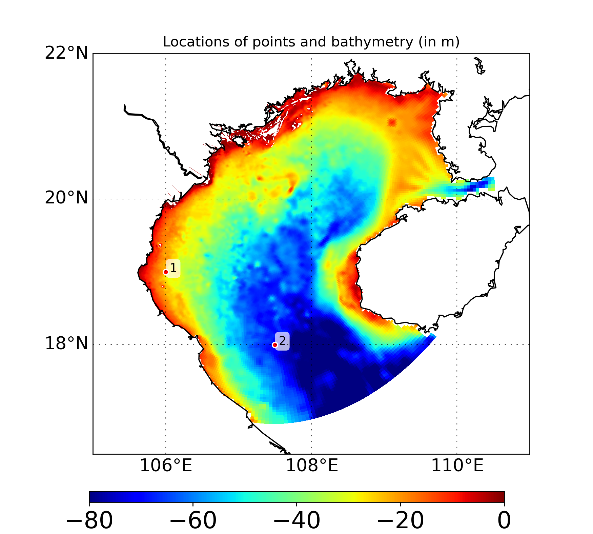
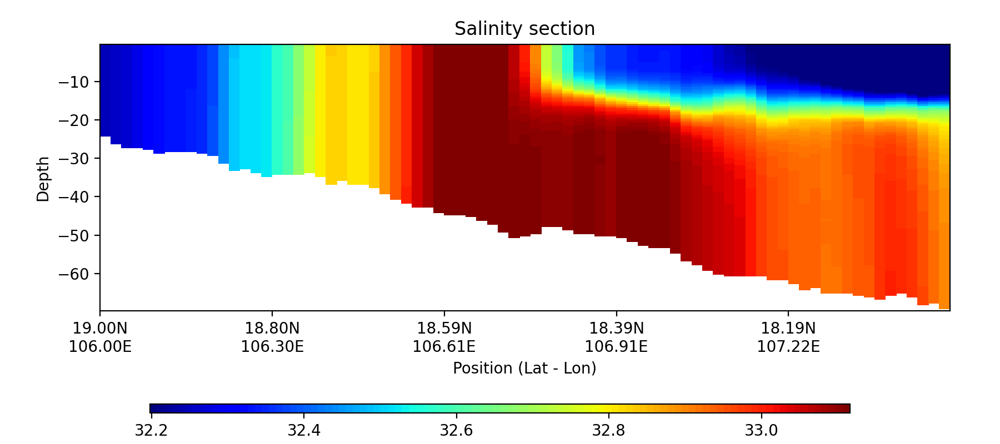
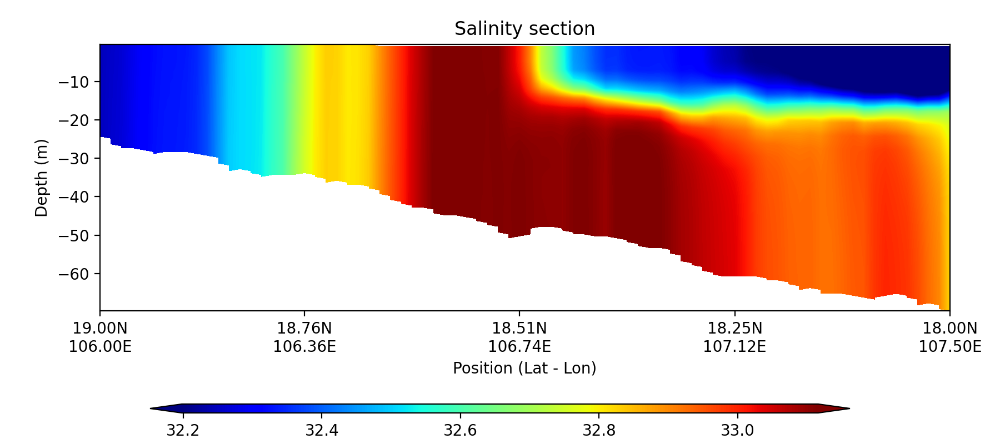

Example 5: Plot a section along two points
==========================================

This example demonstrates how to import file and draw a section plot along two points with GINCCO_lib
using :func:`GINCCO_lib.heatmap_plot.plot_section` and :func:`GINCCO_lib.heatmap_plot.plot_section_contourf`.

Code Example
------------

Now we will import the library and the grid

.. code-block:: python

    # =========================
    # IMPORTS
    # =========================
    import numpy as np
    from netCDF4 import Dataset
    from datetime import *
    import GINCCO_lib as gc

    # =========================
    # CONFIGURATION
    # =========================
    tstart = datetime(2010, 1, 1)
    tend   = datetime(2010, 10, 30)

    path      = '/work/users/tungnd/GOT271/GOT_REF5/OFFLINE/'
    file_name = '20130128_120000.symphonie.nc'

    # =========================
    # LOAD GRID AND DEPTH
    # =========================
    fgrid   = Dataset(path + 'grid.nc', 'r')
    lat_t   = fgrid.variables['latitude_t'][:]
    lon_t   = fgrid.variables['longitude_t'][:]
    mask_t_var = fgrid.variables['mask_t']
    if mask_t_var.ndim == 3:
        mask_t = mask_t_var[0, :, :]
    elif mask_t_var.ndim == 2:
        mask_t = mask_t_var[:, :]

    depth_t = fgrid.variables['depth_t'][:]

    # Apply mask: set land values to NaN
    if mask_t.shape == depth_t.shape:
        # Case 1: mask_t already 3D, same shape as depth_t
        depth_t[mask_t == 0] = np.nan
    elif mask_t.ndim == 2 and depth_t.ndim == 3:
        # Case 2: mask_t is 2D, need to expand to match depth_t
        mask_3d = np.broadcast_to(mask_t, depth_t.shape)
        depth_t[mask_3d == 0] = np.nan
    else:
        raise ValueError(f"Incompatible shapes: depth_t {depth_t.shape}, mask_t {mask_t.shape}")

Now select the section

.. code-block:: python

    # ============================================================
    # EXAMPLE: Extract and plot a salinity section
    # ============================================================

    # Step 1: Define section endpoints
    lon_p = [106, 107.5]
    lat_p = [19, 18]

    # Step 2: Plot section endpoints on bathymetry map
    gc.map_draw_point(
        lon_min=105, lon_max=111,
        lat_min=16.5, lat_max=22,
        title="Locations of points and bathymetry (in m)",
        lon_data=lon_t,
        lat_data=lat_t,
        data_draw=depth_t[0, :, :],
        lat_point=lat_p,
        lon_point=lon_p,
        path_save="/prod/projects/data/tungnd/figure/",
        name_save="demo_7"
    )

Now import data

.. code-block:: python

    # Step 3: Convert saved PNGs into a video
    print('Creating video...')
    gc.pngs_to_video(
        "/prod/projects/data/tungnd/figure/demo_%s_*.png" % session_id,
        "/prod/projects/data/tungnd/figure/clip_%s.mp4" % session_id,
        fps=5
    )

    # Step 4: Delete temporary PNG files
    for path in Path("/prod/projects/data/tungnd/figure").glob("demo_%s_*.png" % session_id):
        try:
            path.unlink()
            print(f"Deleted: {path}")
        except Exception as e:
            print(f"Error deleting {path}: {e}")

Plot using pcolormesh

.. code-block:: python

    # Step 4: Plot section heatmap
    gc.plot_section(
        title='Salinity section',
        data_draw=data_out,
        depth_array=depth_out,     # ndarray, shape (depth, M)
        lon_min=lon_p[0], lon_max=lon_p[1],
        lat_min=lat_p[0], lat_max=lat_p[1],
        path_save="/prod/projects/data/tungnd/figure/",
        name_save="section",
        n_colors=100,   # number of discrete color bins
        n_ticks=5
    )

Plot using contourfill

.. code-block:: python

    # Step 4: Plot section heatmap
    gc.plot_section_contourf(
        title='Salinity section',
        data_draw=data_out,
        depth_array=depth_out,     # ndarray, shape (depth, M)
        lon_min=lon_p[0], lon_max=lon_p[1],
        lat_min=lat_p[0], lat_max=lat_p[1],
        path_save="/prod/projects/data/tungnd/figure/",
        name_save="section",
        n_colors=250,   # number of discrete color bins
        n_ticks=5
    )

